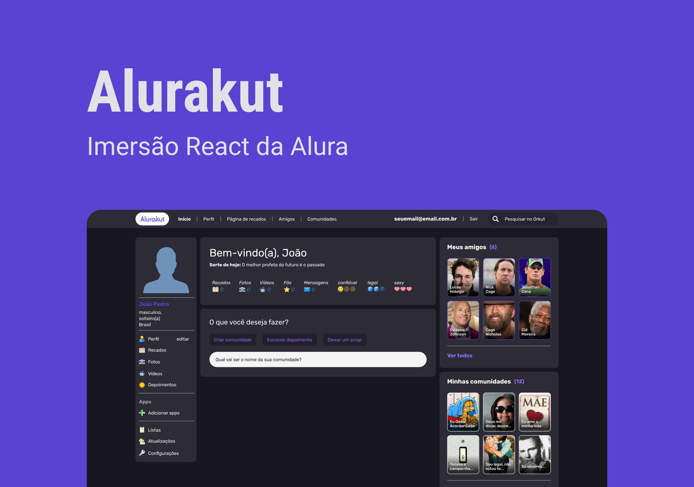

<h1 align="center">Projetos ReactJS & NextJS</h1> 

  <table border="0" cellspacing="0" cellpadding="0">
    <thead>
      <tr>
        <th>
          <strong><a href="https://github.com/joaom00/dogs">Repositório</a></strong>
        </th>
        <th>
          <strong><a href="https://github.com/joaom00/alurakut">Repositório</a></strong>
        </th>
      </tr>
    </thead>
    <tbody>
      <tr>
        <td>
            
        </td>
        <td>
            
        </td>
      </tr>
    </tbody>
  </table>

  <table border="0" cellspacing="0" cellpadding="0">
    <thead>
      <tr>
        <th>
          <strong><a href="https://github.com/joaom00/ecoleta">Repositório</a></strong>
        </th>
        <th>
          <strong><a href="https://github.com/joaom00/happy">Repositório</a></strong>
        </th>
      </tr>
    </thead>
    <tbody>
      <tr>
        <td>
            
        </td>
        <td>
            
        </td>
      </tr>
    </tbody>
  </table>

  <table border="0" cellspacing="0" cellpadding="0">
    <thead>
      <tr>
        <th>
          <strong><a href="https://github.com/joaom00/mememaker">Repositório</a></strong>
          &nbsp;&nbsp;|&nbsp;&nbsp;
          <strong><a href="https://mememaker-lyart.vercel.app">Site</a></strong>
        </th>
        <th>
          <strong><a href="https://github.com/joaom00/moveit-react">Repositório</a></strong>
        </th>
      </tr>
    </thead>
    <tbody>
      <tr>
        <td>
            
        </td>
        <td>
            
        </td>
      </tr>
    </tbody>
  </table>

  <table border="0" cellspacing="0" cellpadding="0">
    <thead>
      <tr>
        <th>
          <strong><a href="https://github.com/joaom00/podcastr">Repositório</a></strong>
        </th>
        <th>
          <strong><a href="https://github.com/joaom00/proffy">Repositório</a></strong>
        </th>
      </tr>
    </thead>
    <tbody>
      <tr>
        <td>
            
        </td>
        <td>
            
        </td>
      </tr>
    </tbody>
  </table>

